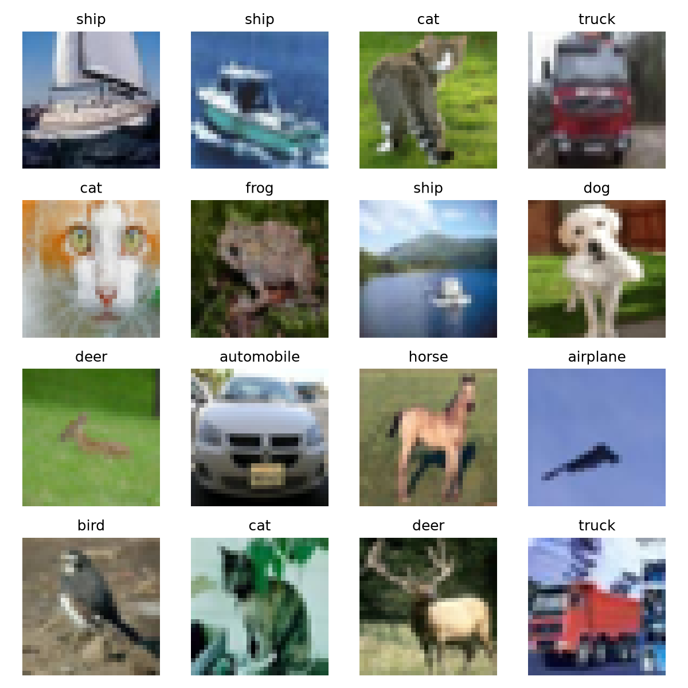

# ShiftGuard AI

ShiftGuard AI is a machine learning research project investigating when neural-network predictions become unreliable under distribution shift.



## Research Question

Can a machine learning system detect when an input differs enough from its training distribution that its prediction should no longer be trusted?

The project focuses not only on whether a neural network makes correct predictions, but also on whether its confidence remains reliable when the input data changes.

## What the Project Does

- Trains a baseline convolutional neural network on CIFAR-10
- Measures prediction accuracy and confidence
- Applies controlled distribution shifts such as blur, noise and brightness changes
- Compares model confidence with actual prediction correctness
- Investigates methods for detecting potentially unreliable predictions
- Aims to develop a reliability score for shifted or unfamiliar inputs

## Current Progress

Completed:

- Development environment and project structure configured
- CIFAR-10 loaded, inspected and visualized
- AMD GPU acceleration configured with ROCm
- Baseline CNN implemented and tested
- Baseline CNN trained for 5 epochs on 50,000 CIFAR-10 training images
- Training accuracy increased from 53.47% to 80.57%
- Training loss decreased from 1.3057 to 0.5520

Next:

- Evaluate the trained model on the unseen CIFAR-10 test set
- Measure clean-data accuracy and prediction confidence
- Introduce controlled distribution shifts
- Analyze how accuracy and confidence change under increasing shift

## How It Works

The first stage establishes a clean baseline.

CIFAR-10 images are normalized and passed through a convolutional neural network consisting of two convolutional blocks followed by fully connected layers.

The model is trained using:

- Cross-entropy loss
- Adam optimizer
- Batch size: 64
- Learning rate: 0.001
- 5 training epochs

After establishing the baseline, the same model will be tested on systematically modified images.

The central question is whether model confidence decreases appropriately when prediction reliability decreases. A model that remains highly confident while becoming increasingly inaccurate represents exactly the type of failure ShiftGuard AI aims to detect.

## Quick Start

The project requires Python and a compatible PyTorch installation.

Activate the virtual environment:

```bash
source .venv/bin/activate
```

Train the baseline CNN:

```bash
python src/train.py
```

The trained model weights are saved locally to:

```text
models/baseline_cnn.pth
```

The `models/` directory is excluded from Git because generated model weights are not part of the source code.

## Technologies

- Python
- PyTorch
- torchvision
- NumPy
- scikit-learn
- Matplotlib
- ROCm
- CIFAR-10

## Development Environment

The project is currently developed and tested with:

- Ubuntu 26.04
- Python 3.14
- PyTorch 2.13 with ROCm
- AMD Radeon RX 9060 XT

PyTorch uses the `torch.cuda` interface for GPU operations when running through ROCm on AMD hardware.

## Research Log

Detailed development notes, technical decisions, observations and experimental results are documented in [`RESEARCH_LOG.md`](RESEARCH_LOG.md).